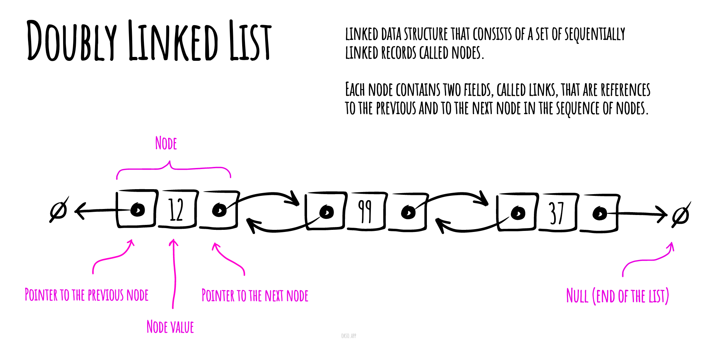

# لیست پیوندی دوطرفه

در علوم کامپیوتر، **لیست پیوندی دوطرفه** یک ساختار داده پیوندی است که از مجموعه‌ای از رکوردهای پیوندی به صورت متوالی تشکیل شده است. هر رکورد شامل دو فیلد به نام‌های پیوند به قبل و به بعد است که به ترتیب به رکورد قبلی و رکورد بعدی در دنباله رکوردها اشاره دارند. پیوندهای قبل و بعد از رکوردهای ابتدایی و انتهای لیست به نوعی پایان‌گر، معمولاً یک رکورد نشانگر یا null، اشاره دارند تا ناوبری در لیست را تسهیل کنند. اگر تنها یک رکورد نشانگر وجود داشته باشد، لیست از طریق رکورد نشانگر به صورت دوری متصل است. می‌توان آن را به عنوان دو لیست پیوندی تصور کرد که از یکسان‌های داده‌ها تشکیل شده‌اند، اما به ترتیب متوالی معکوس.



*ساخته شده با [okso.app](https://okso.app)*

دو پیوند این امکان را به وجود می‌آورند که در هر دو جهت در لیست حرکت کرد. هرچند افزودن یا حذف یک رکورد در لیست پیوندی دوطرفه نیاز به تغییر بیشتری از عملیات مشابه در لیست پیوندی یکطرفه دارد، اما عملیات‌ها ساده‌تر و به نظر موثرتر هستند (برای رکوردهایی که اولین رکوردها نیستند) زیرا نیازی به پیگیری رکورد قبلی در حین ناوبری یا نیاز به ناوبری در لیست برای یافتن رکورد قبلی وجود ندارد تا پیوند آن تغییر کند.

## کد سیگنال برای عملیات اصلی

### درج

```text
افزودن(مقدار)
  قبل: مقدار مقداری است که باید به لیست اضافه شود
  بعد: مقدار به دماغه لیست اضافه شده است
  n ← گره(مقدار)
  اگر سر = ø
    سر ← n
    دماغه ← n
  وگرنه
    n.قبلی ← دماغه
    دماغه.بعد ← n
    دماغه ← n
  پایان اگر
پایان افزودن
```

### حذف

```text
حذف(سر, مقدار)
  قبل: سر گره ابتدایی در لیست است
       مقدار مقداری است که باید از لیست حذف شود
  بعد: مقدار از لیست حذف شده است یا خیر
  اگر سر = ø
    برگردان درست نیست
  پایان اگر
  اگر مقدار = سر.مقدار
    اگر سر = دماغه
      سر ← ø
      دماغه ← ø
    وگرنه
      سر ← سر.بعد
      سر.قبلی ← ø
    پایان اگر
    برگردان درست است
  پایان اگر
  n ← سر.بعد
  تا وقتی که n ≠ ø و مقدار !== n.مقدار
    n ← n.بعد
  پایان تا وقتی
  اگر n = دماغه
    دماغه ← دماغه.قبلی
    دماغه.بعد ← ø
    برگردان درست است
  وگرنه اگر n ≠ ø
    n.قبلی.بعد ← n.بعد
    n.بعد.قبلی ← n.قبلی
    برگردان درست است
  پایان اگر
  برگردان درست نیست
پایان حذف
```

### گردش معکوس

```text
گردش_معکوس(دماغه)
  قبل: دماغه گره نهایی در لیست است
  بعد: لیست به ترتیب معکوس گردش زده شده است
  n ← دماغه
  تا وقتی که n ≠ ø
    به داده n.مقدار بده
    n ← n.قبلی
  پایان تا وقتی
پایان 

گردش_معکوس
```

## پیچیدگی‌ها

### پیچیدگی زمانی

| دسترسی   | جستجو   | درج      | حذف      |
| :-------: | :-------: | :-------: | :-------: |
| O(n)      | O(n)      | O(1)      | O(n)      |

### پیچیدگی فضایی

O(n)

## مراجع

- [ویکی‌پدیا](https://en.wikipedia.org/wiki/Doubly_linked_list)
- [یوتیوب](https://www.youtube.com/watch?v=JdQeNxWCguQ&t=7s&index=72&list=PLLXdhg_r2hKA7DPDsunoDZ-Z769jWn4R8)