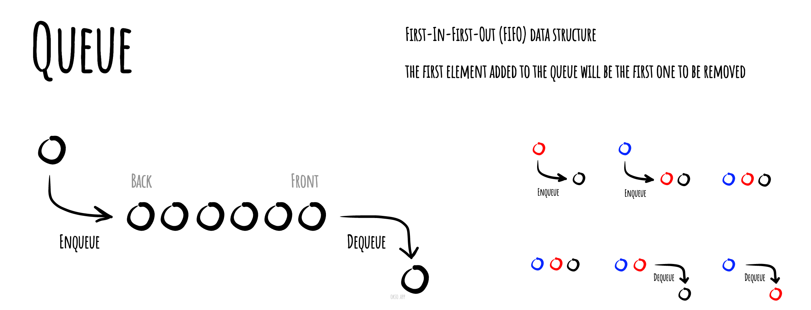

# صف

_Read this in other languages:_
[_english_](README_en.md),

در علوم کامپیوتر، **صف** یک نوع خاص از ساختار داده یا مجموعه انتزاعی است که در آن، موجودیت‌ها به ترتیب نگه داشته می‌شوند و اصل (یا تنها) عملیات‌های مجموعه افزودن موجودیت به موقعیت پایانی پشتوانه، به نام "قرار دادن در صف"، و حذف موجودیت از موقعیت پایانی جلو، به نام "خارج کردن از صف" است. این ویژگی باعث می‌شود که صف یک ساختار داده از نوع "اولین وارد شده، اولین خارج می‌شود" (First-In-First-Out یا FIFO) باشد. در یک ساختار داده FIFO، اولین عنصر اضافه شده به صف، اولین عنصری خواهد بود که حذف می‌شود. این معادل است با شرطی که یک عنصر جدید اضافه شد، باید تمام عناصری که قبلاً اضافه شده‌اند، پیش از اینکه عنصر جدید حذف شود، حذف شوند. اغلب عملیات "نگاه کردن به" یا "عملیات جلو" نیز وارد می‌شود که مقدار عنصر جلو را بدون حذف آن برمی‌گرداند. یک صف نمونه‌ای از یک ساختار داده خطی است، یا به طور انتزاعی یک مجموعه توالی.

نمایش یک صف از نوع FIFO (اولین وارد شده، اولین خارج شده)

*ساخته شده با [okso.app](https://okso.app)*

## پیچیدگی‌های زمانی برای پیاده‌سازی‌های مختلف یک صف

## مراجع

- [ویکی‌پدیا](https://en.wikipedia.org/wiki/Queue_(abstract_data_type))
- [یوتیوب](https://www.youtube.com/watch?v=wjI1WNcIntg&list=PLLXdhg_r2hKA7DPDsunoDZ-Z769jWn4R8&index=3&)