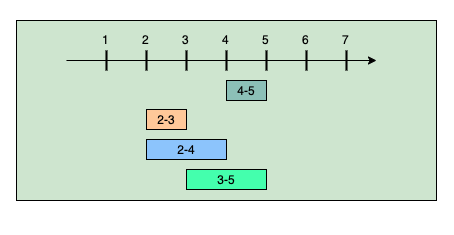

# Minimum Meeting Rooms (hard) ✩

Given a list of intervals representing the start and end time of ‘N’ meetings, 
find the minimum number of rooms required to hold all the meetings.

#### Example 1
Meetings: [[1,4], [2,5], [7,9]]
Output: 2
Explanation: Since [1,4] and [2,5] overlap, we need two rooms to hold these two meetings. [7,9] can 
occur in any of the two rooms later.

#### Example 2
Meetings: [[6,7], [2,4], [8,12]]
Output: 1
Explanation: None of the meetings overlap, therefore we only need one room to hold all meetings.

#### Example 3
Meetings: [[1,4], [2,3], [3,6]]
Output:2
Explanation: Since [1,4] overlaps with the other two meetings [2,3] and [3,6], we need two rooms to 
hold all the meetings.

#### Example 4
Meetings: [[4,5], [2,3], [2,4], [3,5]]
Output: 2
Explanation: We will need one room for [2,3] and [3,5], and another room for [2,4] and [4,5].

Here is a visual representation of Example 4:
